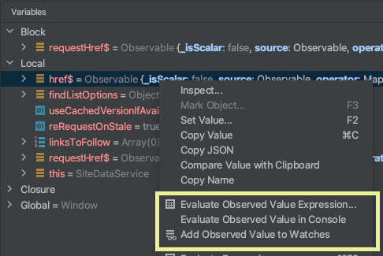
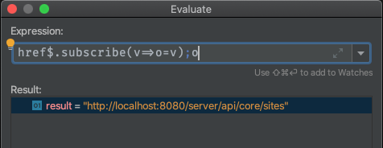

# Debug Observables for IntelliJ

<!-- Plugin description -->
Adds options to evaluate RxJS Observable values when debugging TypeScript or JavaScript.
When an Observable is selected in the Variables view, the
context menu will show three new options:

* Evaluate Observed Value Expression...
* Evaluate Observed Value in Console
* Add Observed Value to Watches

Each option will create an expression that subscribes to
and returns the first value of the selected Observable.
<!-- Plugin description end -->

## Screenshots

Context menu adds actions when an Observable is selected.

Evaluating an observed <em>string</em> value.

## Installation

- Using IDE built-in plugin system:
  
  <kbd>Settings/Preferences</kbd> > <kbd>Plugins</kbd> > <kbd>Marketplace</kbd> > <kbd>Search for "Debug Observables"</kbd> >
  <kbd>Install Plugin</kbd>
  
- Manually:

  Download the [latest release](https://github.com/cwilper/debug-observables/releases/latest) and install it manually using
  <kbd>Settings/Preferences</kbd> > <kbd>Plugins</kbd> > <kbd>⚙️</kbd> > <kbd>Install plugin from disk...</kbd>

---
Plugin based on the [IntelliJ Platform Plugin Template][template].

[template]: https://github.com/JetBrains/intellij-platform-plugin-template
